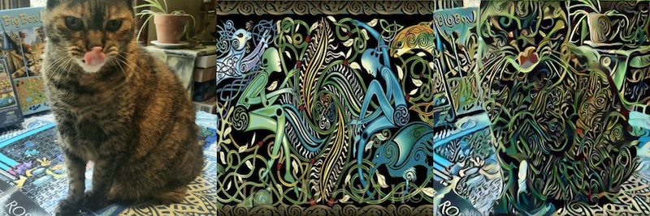

# restyle

A program for transferring a style from one image to 
another using deep learning. 
Adapted from another source and refactored and improved. 
(Can't seem to find the original source repo).
Based on the paper https://arxiv.org/abs/1508.06576.

Designed to run on GPUs



Can be run on Google Colab as follows:
-----------------

* With your Google account open, visit https://colab.research.google.com/
* Under the File tab choose 'Open notebook'
* Choose github
* Enter the address for this repo
https://github.com/dj-tw/restyle and press Return
* Click on the iPython notebook named Pipeline.ipynb
* Under Runtime choose, 'Change runtime type' and choose 
the GPU option
* Under Runtime choose 'Restart runtime'. This will ensure that 
your runtime has a GPU. If you don't use GPU on Colab, it will 
throw an error (unless you tell it not too in params). 
Will work locally with CPU.
* Now uncomment the '!git clone' and '% cd restyle' commands 
and run just that cell. Afterwards, comment them out again. 
Be sure to leave the ! and % symbols in place but leave no
whitespace before them.
* Now you are ready to run. However, before you do, gather up 
the two images you want to use; one for content and one 
for style. Sizes don't matter as they will be resized 
inside of the pipeline. If you want, you can use the two in the 
example_data directory of this repo. This is my cat (for content) 
and an artsy photo (for style) that I found somewhere online. 
* Now, time to run. Under Runtime choose 'Run all'. 
* This will wait on the content = upload_image_file('content', params) 
cell. It is waiting for you
to push the 'Choose Files' button that appears in that cell. Push it!
* This will bring up a file navigator on your local machine and you 
should select the content files that you want to 
use.
* Afterwards do, the same thing for the style image. Don't forget 
to press the buttons. 
* After selecting those files and uploading them, the rest of the 
pipeline will run. It will show you the final image as well 
as all three. It will be saved as result.png. You can download it by
choosing the file icon on the left bar and navigating into restyle
subdirectory. You'll see result.png. Right click 
(two finger click on Mac) and choose Download. Sometimes I've found 
the download not to work. If it doesn't double click on it and it
will appear on the right side. You can right click on that image and 
choose 'Save Image As ....' which basically uses the downloader 
of your browser. That should always work.

Iterating
------------
The default run will use a set of default parameters which are 
printed by the get_params() call in the 5th cell. If you want to
modify any of the parameters, just change it to 
get_params(n_iter=500), for example and that keyword will 
override the default. 

You can run again by choose 'Run after' under Runtime while 
this cell is still highlighted. That will avoid having to 
re-upload the files and will run the rest of the cells. 

Obviously higher n_iter, image_width, image_height will give 
different (probably better) results but will take longer. 
Usually, image_width, image_height of 512 produces a high
enough resolution image. The final image will be rescaled back
to original size at the end regardless. Usually n_iter of a 
few thousand is required to get the full effect that you are looking 
for. But it requires some experimentation.

Parameters
--------------
Here are the parameters that will be most useful and some good
starting values. 

n_iter: 1000 (Number of iterations, a few thousand usually needed)

Next two are the image size converted to before handing off to the
core algorithm. 128 and 256 are OK for faster experimentation but
512 is best for final results. Final images will be rescaled back
to original dimensions.

image_width: 512

image_height: 512

Now comes the three coupling constants which set the weighting 
of three loss terms in the total loss. Basically the optimization
is trying to balance three things: 1) Keeping the content image
recognizable, 2) maintaining closeness to the desired style, 
and 3) Being relatively smooth. These weights are defined by the 
next three numbers. 

content_weight: 1.0 (Leave this at 1, the relative ratios is what 
matters)

style_weight: 1.0 (Higher weight makes it closer to the style 
at the expense of maintaining recognizable content and vice versa.)

total_variation_weight: 10.0 (Higher means the image will be 
smoother and vice versa. This is the penalty weight given to 
differences of neighboring pixels. It's not usually as 
important as style_weight.)

The next values determine how the image is initialized. These are a 
few choice. 'content', 'style', 'noise' or 'hybrid'. The first three
should be self explanatory. If hybrid is chosen, then a weighted 
average of all three is used and then the next two numbers are the 
weights. The weights add up to 1 so 1-(content_weight + style_weight)
is the noise_weight. 

input_image: hybrid

hybrid_weight_content: 0.9

hybrid_weight_style: 0.0

show_image_interval: 50 (The iteration interval to show an image
of the current solution (not rescaled to original).)

Don't mess with the next two. They are properties of the 
neural network. For experts only. 

content_layers: ['conv_1', 'conv_2', 'conv_4']

style_layers: ['conv_2', 'conv_3', 'conv_4', 'conv_7', 'conv_10', 'conv_8']

These four define the file names of the relevant files once uploaded.

content_image_path: content.png

style_image_path: style.png

output_image_path: result.png

combined_image_path: combined.png

plot_y_range: (0.5, 10000) (The y-range used when showing the loss
plot at the requested intervals. It shows each component.)

random_seed: 420 (The random seed used if you are making use of 
noise in the initialization.)

demand_cuda_on_colab: True (This is to ensure that you are using
GPU on Colab. If not, what's the point of using Colab?. You can just 
run on your laptop if you want to use CPU). But if you really want,
you can turn this to False and use CPU on Colab.

Running locally
----------------
You can run it locally on your CPU or if you have a GPU (untested, don't have one,
but should work).

git clone https://github.com/dave31415/restyle.git

cd restyle

source install.sh

Now can either run in python, ipython or ipython notebook.

python
```
from restyle.pipeline import pipline
pipeline()
```

Or

ipython notebook

and open the Pipeline.ipynb notebook

and proceed with 'Run all' (skipping the colab specific steps above)

Now go create some great art!


